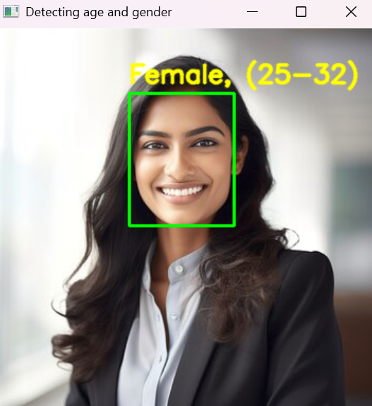
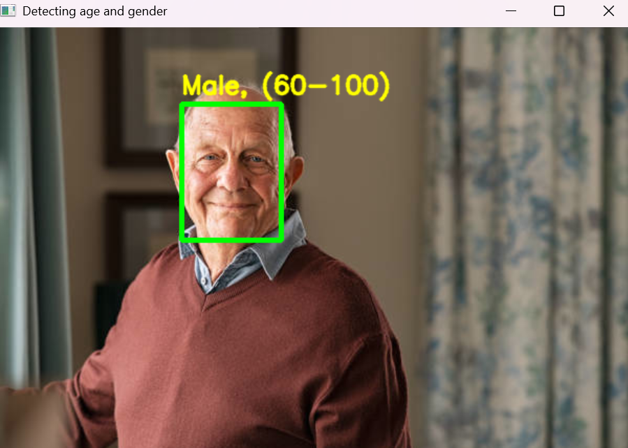
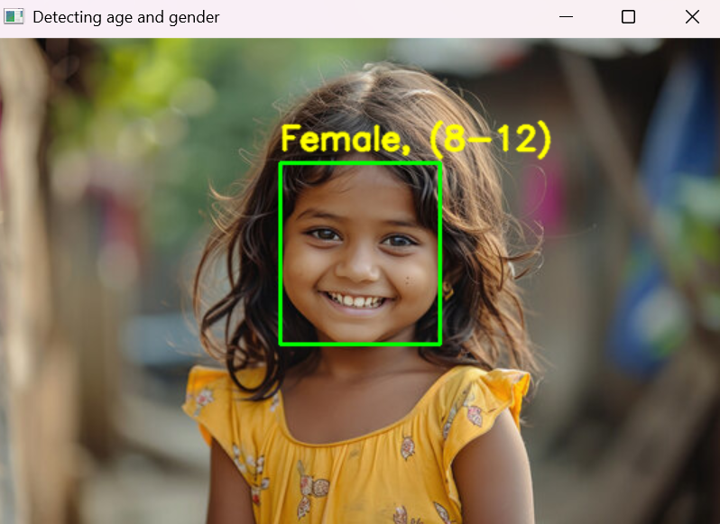

# Gender-and-Age-Detection

<h2>Objective</h2>

Develop a gender and age detection system capable of estimating the gender and age range of a person based on their facial image, either from a photo or a webcam feed.

This Python-based project leverages deep learning techniques to estimate gender and age from a single facial image. The models, pre-trained by Tal Hassner and Gil Levi, have been utilized to perform these predictions. The gender prediction outputs one of two categories: Male or Female. For age, the system predicts one of the following predefined ranges:

(0 – 2)
(4 – 6)
(8 – 12)
(15 – 20)
(25 – 32)
(38 – 43)
(48 – 53)
(60 – 100)
The classification approach was chosen over regression due to the inherent challenges in pinpointing an exact age from a single image. Factors such as makeup, lighting, obstructions, and facial expressions can significantly impact accuracy. By framing it as a classification problem, the model can effectively assign the image to the most probable age range.

<h2>Additional Python Libraries Required :</h2>
<ul>
  <li>OpenCV</li>
          
     pip install opencv-python
  
</ul>
<ul>
 <li>argparse</li>
  
     pip install argparse
</ul>
<h2>Contents :</h2>
<ul>
  <li>opencv_face_detector.pbtxt</li>
  <li>opencv_face_detector_uint8.pb</li>
  <li>age_deploy.prototxt</li>
  <li>gender_deploy.prototxt</li>
  <li>a few pictures to try the project on</li>
  <li>detect.py</li>
 </ul>

For face detection, we have a .pb file- this is a protobuf file (protocol buffer); it holds the graph definition and the trained weights of the model. We can use this to run the trained model. And while a .pb file holds the protobuf in binary format, one with the .pbtxt extension holds it in text format. These are TensorFlow files. For age and gender, the .prototxt files describe the network configuration 

 <h2>Usage :</h2>
 <ul>
  <li>Download my Repository</li>
  <li>Open your Command Prompt or Terminal and change directory to the folder where all the files are present.</li>
  <li><b>Detecting Gender and Age of face in Image</b> Use Command :</li>
  
  
      python detect.py --image <image_name>
</ul>
 
<b>Note: </b>The Image should be present in same folder where all the files are present
 
<ul>
  <li><b>Detecting Gender and Age of face through webcam</b> Use Command :</li>
  
      python detect.py
</ul>
<h2>Working And Examples</h2>
            
    >python detect.py --image woman_1.jpg
    Gender: Female
    Age: 25-32years 

 
    >python detect.py --image oldman_2.jpg
    Gender: Male
    Age: 60-100 years
    
    

          
><li>python detect.py --image man_1.jpg</li>
    <li>Gender: Man</li>
   <li> Age: 25-32 years </li> 

    

    >python detect.py --image girl_2.jpg
    Gender: Female
    Age: 8-12 years  
    

            
    
